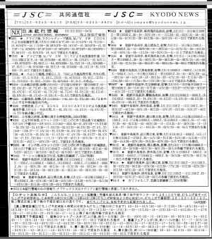

# radio_fax_decoder

Utility to decode radio fax from recorded WAV file. Parts taken from Kiwi SDR repository at https://github.com/jks-prv/Beagle_SDR_GPS/

## V1.0.0.

Basic funcionality works. Reads recorded sound and converts it into the image.

Can read mono or stereo files.

Clock drift can be adjusted by providing a difference from file's sample rate and
(guessed) real rate. Default is 1.

Default, uncorrected image might look slanted like this:

Providing a correction factor of 1.0000106 straightens it up:

Currently there's no automatic correction, so usually it is by trial and error. Utility can be killed at any time after a few seconds to preview the slant. As it is really fast, there's no problem with that. 2 hours fax is usually parsed in a minute or two, that's quick enough.

If there are multiple faxes recorded in one fax, you'll get one big picture. But if automatic alignmen works, all of them will be centered normally. It does not work sometimes with particular fax types, unfortunately.

LPM can be provided. E.g. 60 for Kyodo News.

Center frequency by default is 1900, but can also be changed if required.

Example usage:

`./fax -s 1.0000055 -w ~/audio_2023-02-10_07-11-01_3853100Hz.wav`
`./fax -s 1.0000091 -lpm 60 -c 1500 -w ~/audio_2023-02-05_09-40-01_16969500Hz.wav`

Also, if image is not centered automatically, utility can be given an amount of samples to drop, e.g. `-d 3000`.

## Known issues

* Compiles on Raspbery Pi, but crashdumps. To be attended in the future.
