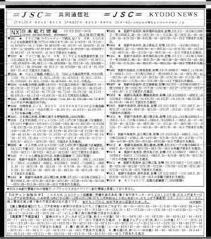

# radio_fax_decoder

Utility to decode radio fax from recorded WAV file. Parts taken from Kiwi SDR repository at https://github.com/jks-prv/Beagle_SDR_GPS/
## V1.0.3

A few cumulative changes:
* Drop an amount of lines with `--drop_lines` / `-r` option (slant not taken into account, only samples per sec and LPM)
* Drop an amount of pixels with `--drop_pixels` / `-x` option (slant not taken into account)
* Use original file name instead of the generated, only replace the extension
* Use `-n` shorthand for the option to drop samples
* Add some speed by loading more bytes into memory, leaving only mono (1 channel) support and tweaking GCC options

## V1.0.1

Adapted to work on Raspberry Pi.

Speed comparison. My i7-1165G7 laptop converts 120 LPM 40 minutes 12001 sample/sec WAV file into the 1809x2300 px image in 4 seconds. Rasbperry Pi gen 3 does the same job in 45 seconds, which is __still fast enough__ for some automation.

## V1.0.0.

Basic functionality works. Reads recorded sound and converts it into the image.

Can read mono or stereo files.

## Usage

Radio faxes are very sensitive to transmitter and receiver clock differences. It is an analogue format, there is no "protocol" for finding the end of line. There is a phasing sequence, but it is usually too short to evaluate the drift properly (I tried it, doesn't work miracles). Also, digital sampling adds its own errors, as no soundcard provides "perfect" advertized sampling rate.

So the best way is to try to decode the image, evaluate its tilt and provide a clock drift, which is usually miniscule. Run decoder for a few seconds and kill it with CTRL+C, don't wait until full file is decoded. Evaluate, repeat.

Clock drift can be adjusted by providing a difference from file's sample rate and
(guessed) real rate. Default is 0. If there is a clock drift, it is provided in the millionth parts.

Default, uncorrected image might look slanted like this:

Providing a correction factor of 1.06 straightens it up:

Currently there's no automatic correction, so usually it is by trial and error. Utility can be killed at any time after a few seconds to preview the slant. As it is really fast, there's no problem with that. 2 hours fax is usually parsed under a minute, that's quick enough.

If there are multiple faxes recorded in one WAV file, you'll get one big picture. But if automatic alignment works, all of them will be centered normally. It does not work sometimes with particular fax types, unfortunately.

LPM can be provided. E.g. 60 for Kyodo News.

Center frequency by default is 1900, but can also be changed if required.

Example usage:

* `./fax -s 55 -w ~/audio_2023-02-10_07-11-01_3853100Hz.wav`
* `./fax -s 9.1 -lpm 60 -c 1500 -w ~/audio_2023-02-05_09-40-01_16969500Hz.wav`

Also, if image is not centered automatically, utility can be given an amount of samples to drop, e.g. `-d 3000`.

Automatic alignment sometimes falsely detects alignment "sequence" midst decoding and image is cut and shifted. If this occurs, try `--no_phasing`.

By default, all fax is decoded, including phasing headers. If they bother you, try `--no_header`.

For multiple faxes in one WAV file try `--auto_stop`, it will save wasted image space, if there is longer period between faxes. But it also tends erroneous skipping of several real image lines. So not too much use of it.

## Known issues

* "auto stop" can skip real image parts.
* Automatic phasing is not very accurate.

## Building

As simple as it can be, at least, on Linux.

* `cd radio_fax_decoder`
* `mkdir build`
* `cd build`
* `cmake ..`
* `make`

Should to it.
